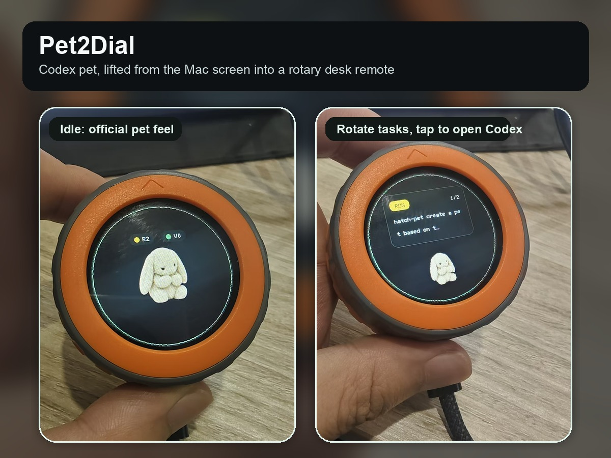

# Pet2Dial

Turn the Codex desktop pet into a tiny external hardware companion and rotary task remote on an M5Stack Dial.

Pet2Dial is a Codex skill and hardware bridge that takes the currently selected Codex custom pet, converts its official animated pet atlas into M5Stack Dial firmware assets, flashes the Dial, and keeps it synchronized over Bluetooth Low Energy. The goal is to preserve the feel of the official Codex pet experience while moving it out of the Mac display and onto the desk. The Dial becomes both a small physical pet companion and a handheld-style remote: rotate to browse running or review tasks, tap to open the matching Codex conversation.



## Why This Exists

Codex already has a delightful pet mode inside the desktop app. Pet2Dial asks a simple question: what if that pet could leave the screen and sit on the desk?

The result is a small desk companion for people who run many Codex tasks at once. It shows:

- the same selected Codex custom pet, converted from the official pet atlas
- current running Codex tasks
- completed tasks waiting for review
- a rotary task card UI made for the Dial's physical knob
- tap-to-open navigation back into the matching Codex Desktop conversation

The project uses the M5Stack Dial as an always-visible, tactile status surface and a compact Codex remote instead of another window on the Mac.

## Hardware

- M5Stack Dial, powered by M5StampS3
- Mac running Codex Desktop
- USB-C cable for firmware flashing
- Bluetooth Low Energy for daily sync after flashing

The M5Stack controller is central to the project: it runs the firmware, renders the circular UI, reads touch/rotary input, and exposes the BLE peripheral that the Mac bridge talks to.

## What It Does

Pet2Dial follows the shortest proven path:

1. Detect the selected Codex custom pet in `~/.codex/pets`.
2. Read the official Codex `spritesheet.webp` pet atlas.
3. Convert the 8x9 atlas into one compact 96x96 RGB565 firmware resource.
4. Build and flash M5Stack Dial firmware with PlatformIO.
5. Start a Mac BLE bridge named `CodexDial`.
6. Sync Codex pet state plus running/review tasks.
7. Open `codex://threads/<thread_id>` when a Dial card is tapped.

The default build intentionally includes only one pet. This keeps flash usage stable and makes the first install predictable.

## Quick Start

Install or clone this repository, then run:

```bash
python3 skill/pet2dial/scripts/pet2dial.py doctor
python3 skill/pet2dial/scripts/pet2dial.py init --force
python3 skill/pet2dial/scripts/pet2dial.py setup-env
python3 skill/pet2dial/scripts/pet2dial.py convert
python3 skill/pet2dial/scripts/pet2dial.py build
python3 skill/pet2dial/scripts/pet2dial.py upload
python3 skill/pet2dial/scripts/pet2dial.py run-bridge
```

For a first install with the Dial already connected over USB:

```bash
python3 skill/pet2dial/scripts/pet2dial.py success-path --upload
```

For daily use, install the Mac bridge as a login service:

```bash
python3 skill/pet2dial/scripts/pet2dial.py install-autostart
python3 skill/pet2dial/scripts/pet2dial.py status
python3 skill/pet2dial/scripts/pet2dial.py logs
```

`run-bridge` and `install-autostart` self-heal the generated project, virtual environment, and missing Python dependencies. On macOS the bridge is launched through a generated `CodexDialBridge.app` wrapper so Bluetooth permissions are handled by the system privacy model. The wrapper is generated as an agent app, so it runs in the background without a Dock icon.

By default the generated working project is created at:

```text
~/CodexDialPet
```

## Skill Usage

Pet2Dial is also a Codex skill. Install the skill folder into:

```text
~/.codex/skills/pet2dial  (source folder: skill/pet2dial)
```

Then ask Codex:

```text
Use pet2dial to put my current Codex pet on my M5Stack Dial.
```

The skill checks the environment, creates a clean project, installs dependencies locally, converts the pet, builds the firmware, uploads it, and runs the BLE bridge.

## UI Model

The idle view keeps the pet visible. Running and review counters sit above it.

Rotating the Dial opens a task card view. The pet shrinks down and the card shows the selected task. Tapping opens the Codex conversation. A review card remains visible after the tap and is marked seen only after the user rotates away or returns to the pet view.

Review cards are derived from Codex session events where `event_msg.payload.type == "task_complete"`. Existing historical completions are baselined as already seen so the Dial starts with current work instead of an old completion backlog. To clear the current review backlog manually:

```bash
python3 skill/pet2dial/scripts/pet2dial.py clear-review-backlog
```

This behavior is implemented with a small BLE event protocol:

```text
CLICK|<thread_id>  opens the Codex conversation
LEAVE|<thread_id>  marks an opened review card as seen
```

Bridge logs record both the incoming click and the result of opening the Codex URL. This makes the tap-to-open path diagnosable across the hardware, BLE bridge, and macOS URL handler boundary.

## Codex Pet Conversion

Pet2Dial uses Codex-compatible custom pets:

```text
~/.codex/pets/<pet-id>/pet.json
~/.codex/pets/<pet-id>/spritesheet.webp
```

The expected atlas geometry is:

```text
1536x1872 atlas
192x208 cells
8 columns
9 animation rows
```

The firmware uses:

```text
single pet
96x96 frames
8 frames per row
9 rows
RGB565
```

## Project Layout

```text
SKILL.md                         Codex skill entry point
skill/pet2dial/scripts/pet2dial.py              one-shot setup, build, upload, bridge runner
skill/pet2dial/templates/project/firmware       M5Stack Dial PlatformIO firmware
skill/pet2dial/templates/project/codex_dial_bridge
                                  Mac-side BLE bridge
skill/pet2dial/templates/project/tools          Codex pet atlas converter
skill/pet2dial/references/success-contract.md   the exact success path and fixed defaults
docs/hackster                    Hackster submission copy
```

## Validation

The version in this repository was validated with:

```text
quick_validate.py skill/pet2dial
pet2dial.py init
pet2dial.py setup-env
pet2dial.py convert
PlatformIO firmware build
```

Observed firmware usage:

```text
RAM:   15.4%
Flash: 78.9%
```

## Contest Note

This project was built for the M5Stack Global Innovation Contest 2026. It uses an M5Stack controller product, was first prepared for Hackster publication in 2026, and includes both hardware and software documentation.

## License

MIT.

## 中文摘要

Pet2Dial 是一个把 Codex 桌面宠物搬到 M5Stack Dial 上的开源项目。它读取 Codex 当前选中的 custom pet，把官方 `spritesheet.webp` 宠物 atlas 转成 Dial 固件里的 `96x96` RGB565 动画资源，然后用蓝牙同步 Codex 的运行中任务和待 review 任务。

Dial 的圆形屏幕负责显示宠物和任务状态；旋钮负责切换任务卡片；点击屏幕会打开对应的 Codex 会话。固件刷入后，日常同步走 BLE，Mac 的 USB-C 口可以空出来。

这个项目的目标是把 AI coding workspace 从电脑屏幕里延伸出来，变成桌面上一个可触摸、可旋转、可一眼看到状态的硬件伴侣。
